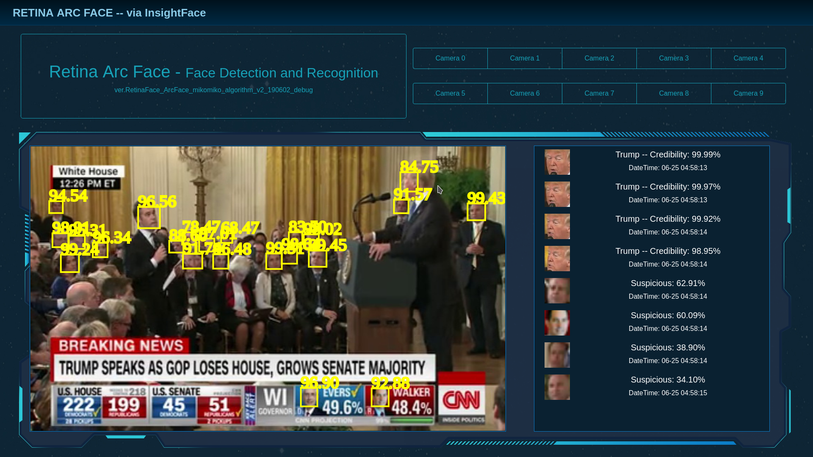

# Real-Time ArcFace Multiplex Recognition

Face Detection and Recognition using RetinaFace and ArcFace, can reach nearly 24 fps at GTX1660ti.




## How to run

* Install yarn
  * `sudo apt install curl`
  * `curl -sS https://dl.yarnpkg.com/debian/pubkey.gpg | sudo apt-key add -`
  * `echo "deb https://dl.yarnpkg.com/debian/ stable main" | sudo tee /etc/apt/sources.list.d/yarn.list`
  * `sudo apt update && sudo apt install yarn`
* Electron Node-JS Client
  * `cd electron-client`
  * `yarn` or `npm install`
  * `yarn start` or `npm start`
* Build R-CNN for Retina Face
  * `cd ..`
  * `chmod a+x ./build_rcnn.sh`
  * `./build_rcnn.sh`
* Python Deal
  * `python3 usb_camera.py -c X` e.g: Replace X with 0
  * Click the corresponding `Camera {X}` Button at Electron


## How to train mlp classifier

* `mkdir ./Temp/raw`
* `mkdir ./Temp/train_data`
* Place training pictures in the following format：

    ```shell
    ─── train_data
        ├── bush
        │   ├── 1559637960.1595788.jpg
        │   ├── 1559637960.1762984.jpg
        │   └── 1559637960.2001894.jpg
        ├── clinton
        │   ├── 1559637960.2104468.jpg
        │   ├── 1559637960.2225769.jpg
        │   └── 1559637960.281161.jpg
        └── obama
            ├── 1559637960.2940397.jpg
            ├── 1559637960.31212.jpg
            └── 1559637960.3381834.jpg
    ```

* `python3 train_mlp.py`


## Verification

*LResNet100E-IR* network trained on *MS1M-Arcface* dataset with ArcFace loss:

| Method  | LFW(%) | CFP-FP(%) | AgeDB-30(%) |  
| ------- | ------ | --------- | ----------- |  
|  Ours   | 99.80+ | 98.0+     | 98.20+      |   


## Citation

```
@inproceedings{deng2020retinaface,
  title={Retinaface: Single-shot multi-level face localisation in the wild},
  author={Deng, Jiankang and Guo, Jia and Ververas, Evangelos and Kotsia, Irene and Zafeiriou, Stefanos},
  booktitle={Proceedings of the IEEE/CVF conference on computer vision and pattern recognition},
  pages={5203--5212},
  year={2020}
}

@inproceedings{deng2019arcface,
  title={Arcface: Additive angular margin loss for deep face recognition},
  author={Deng, Jiankang and Guo, Jia and Xue, Niannan and Zafeiriou, Stefanos},
  booktitle={Proceedings of the IEEE/CVF conference on computer vision and pattern recognition},
  pages={4690--4699},
  year={2019}
}
```
